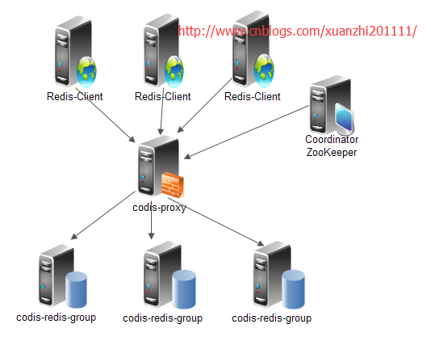

# Codis集群的搭建与使用
## 一、简介  

Codis是一个分布式的Redis解决方案，对于上层的应用来说，连接Codis Proxy和连接原生的Redis Server没有明显的区别（不支持的命令列表），上层应用可以像使用单机的Redis一样使用，Codis底层会处理请求的转发，不停机的数据迁移等工作，所有后边的一切事情，对于前面客户端来说是透明的，可以简单的认为后边连接是一个内存无限大的Redis服务。

* codis-proxy 提供连接集群redis服务的入口
* codis-redis-group 实现redis读写的水平扩展，高性能
* codis-redis 实现redis实例服务，通过codis-ha实现服务的高可用